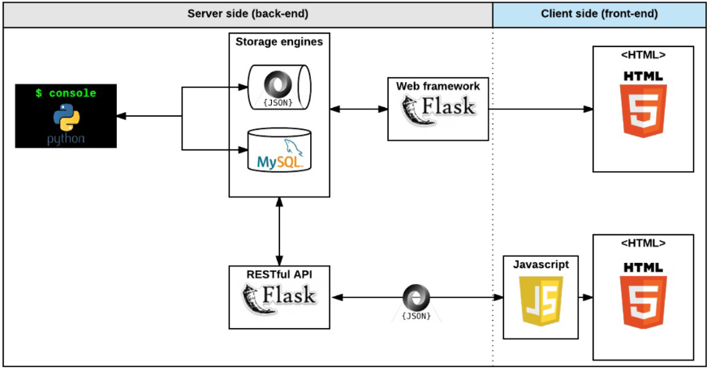
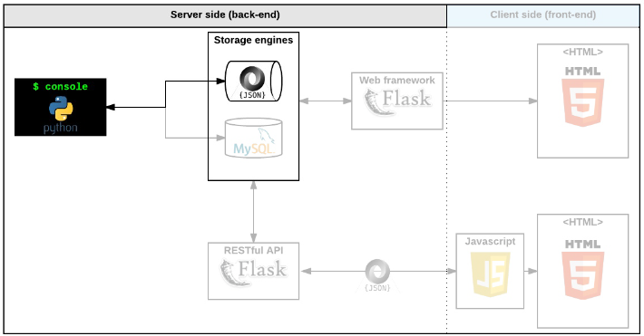
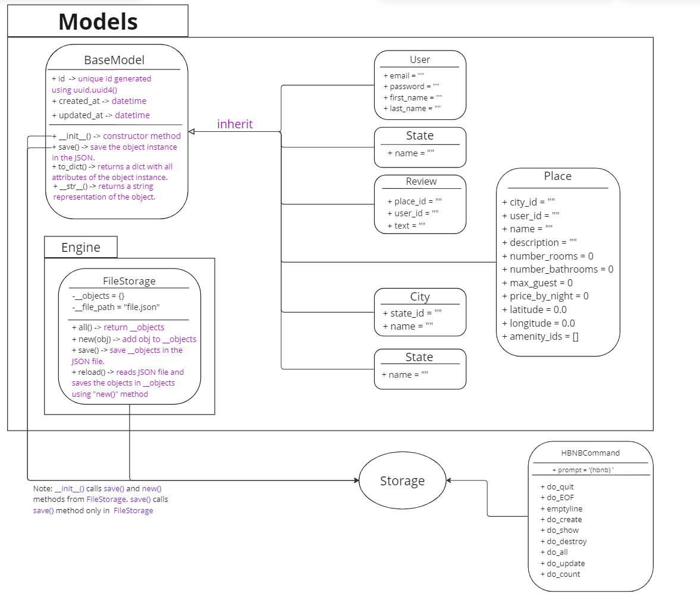

# 0x00. AirBnB clone - The console


## Contents:
* [Project Description](#Project-Description)
* [The Console](#The-Console)
* [Objectives of the Project](#Objectives-of-the-Project)
* [Installation](#Installation)

## Project Description
The AirBnB clone project aim to deploy on your server a simple copy of the [AirBnB website](https://www.airbnb.com/).
The AirBnB project is a complete web application composed by (Full project Diagram below):
* A command interpreter to manipulate data without a visual interface, like in a Shell (perfect for development and debugging).
* A website (the front-end) that shows the final product to everybody: static and dynamic.
* A database or files that store data (data = objects).
* An API that provides a communication interface between the front-end and your data (retrieve, create, delete, update them).



**Note:** the first part of this project is to Implement **the Console** and the data(Objects) will be stored in JSON file. the **Image** below shows the parts Implemeted in the first part of the project.

## The Console
Throughtout Implementing the console the following operations has been done (see the Image below):
* creating the data model
* managing (create, update, destroy, etc) objects via a console (command interpreter)
* storing and persisting objects to a file (JSON file)



**The UML digram of this Project "AirBnB the console"**:

UML stands for Unified Modeling Language, which is a graphical notation used in software engineering to represent the structure and behavior of a system. UML diagrams can be used to model various aspects of software development, including object-oriented programming.

In object-oriented programming, UML diagrams are used to represent the classes, objects, methods, and relationships between them.

- It is good to read [UML Class Diagram](https://www.visual-paradigm.com/guide/uml-unified-modeling-language/uml-class-diagram-tutorial/)



## Objectives of the Project
* How to create a Python package
* How to create a command interpreter in Python using the `cmd` module
* What is Unit testing and how to implement it in a large project
* How to serialize and deserialize a Class
* How to write and read a JSON file
* How to manage `datetime`
* What is an `UUID`
* What is `*args` and how to use it
* What is `**kwargs` and how to use it
* How to handle named arguments in a function

To see the fundamental background of the project visit the [Wiki](https://github.com/ralexrivero/AirBnB_clone/wiki).

## Installation
* Cloning the repo:
```
git clone https://github.com/Ali-Mahmoud98/AirBnB_clone
```
* Running the Console:
```
cd AirBnB_clone
./console
```
* Commands and their usage:

| Command | Usage | Example | Description
|--|--|--|--|
| create | `create <class  name>` | create BaseModel | Creates a new instance of BaseModel, saves it (to the JSON file) and prints the id. |
| show | `show <class  name>  <id>` | show BaseModel 1234-1234-1234 | Prints the string representation of an instance based on the class name and id. |
| destroy | `destroy <class  name>  <id>`| destroy BaseModel 1234-1234-1234 | Deletes an instance based on the class name and id (save the change into the JSON file). |
| all | `all <class  name> or all` | all BaseModel | Prints all string representation of all instances based or not on the class name. |
| update | `update <class  name>  <id>  <attribute  name> "<attribute  value>"` | update BaseModel 1234-1234-1234 email "aibnb@holbertonschool.com" | Updates an instance based on the class name and id by adding or updating attribute (save the change into the JSON file). |
| all() | `<class  name>.all()` | User.all() | Retrieve all instances of a class |
| count() | `<class  name>.count()` | User.count() | Retrieve the number of instances of a class |
| show() | `<class  name>.show(<id>)` | User.show("246c227a-d5c1-403d-9bc7-6a47bb9f0f68") | retrieve an instance based on its ID |
| destroy() | `<class  name>.destroy(<id>)` | User.destroy("246c227a-d5c1-403d-9bc7-6a47bb9f0f68")| Destroy an instance based on his ID |
| update() | `<class  name>.update(<id>, <attribute  name>, <attribute  value>)` | User.update("38f22813-2753-4d42-b37c-57a17f1e4f88", "age", 89) | Update an instance based on his ID |
| update() with dictionary | `<class  name>.update(<id>, <dictionary  representation>)` | User.update("38f22813-2753-4d42-b37c-57a17f1e4f88", {'first_name': "John", "age": 89}) | Update an instance based on his ID with a dictionary |

**Imporatant:** All the development and testing was runned over an operating system Ubuntu 22.04.3 LTS using programming language Python 3.10.12.
